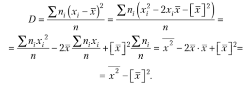

## 178.Coins
### [Problem](https://coderun.yandex.ru/problem/stump?currentPage=1&groups=data-analytics&groups=ml&pageSize=20&search=)

### Idea od my solution:
1. Sorting input by x coordinate ```Comp: O(nlogn)```
2. Selection of threshhold $c$ on one of $x_i$ ```Comp: O(n)```
3. To minimize MSE on each candidate of $c$ we want to make $a = \frac{\sum_{i}^l y_i}{l}$, where $l$ is amount of $x_i < c$ and $b = \frac{\sum_{i}^{n-l} y_i}{n-l}$ ```Comp: O(1)```
4. On each step counting MSE with candidates of $a$, $b$ and $c$ ```Comp: O(1)```
5. Answer - $a$, $b$ and $c$ with minimal MSE


#### Note: Recounting MSE for constant time on each step can be made with formula 